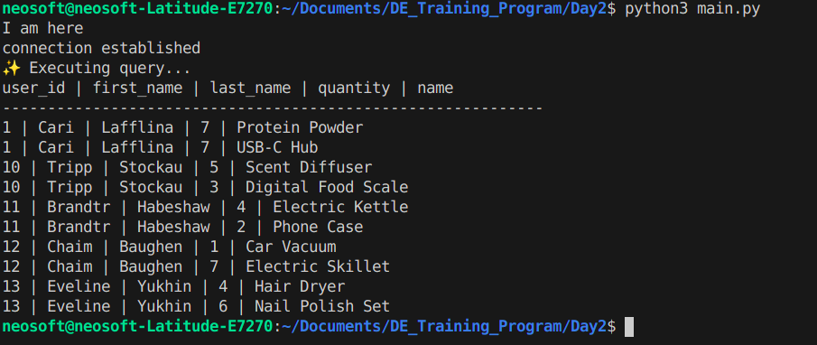

---------SQL JOINS -

1. INNER JOIN

3. LEFT JOIN

3. RIGHT JOIN
   

4. CROSS JOIN

5. UNION
   

--------- WINDOWS FUNCTION 

1. SUM,COUNT, AVG
   

2. ROW_NUMBER()

3. RANK()

4. DENSE_RANK()

5. PARTITION()

--------- STORED PROCEDURE

--------- VIEWS

